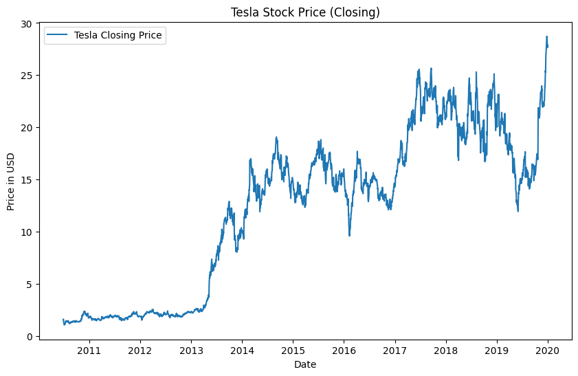
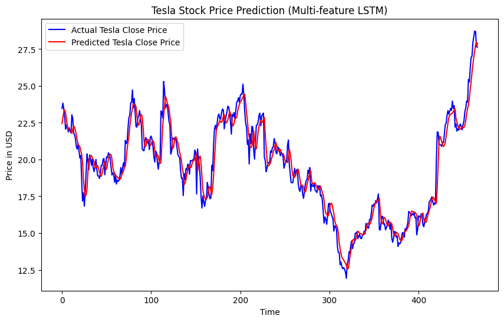

# Stock Price Prediction using Multi-Feature LSTM
## 💡 Project Goal
The primary goal of this project is to build a robust deep learning model to predict the next day's closing price of a stock. While simple models often rely on a single feature (e.g., historical closing prices), this project explores a more advanced approach by incorporating a wider range of market data to improve prediction accuracy.

## 📊 The Workflow: A Step-by-Step Breakdown
This project follows a standard machine learning workflow, but with specific considerations for time-series data. The entire process is contained within the provided Google Colab Notebook.

### Step 1: Data Acquisition & Initial Exploration
  - Tool: yfinance
  - Action: The notebook begins by downloading historical stock data for Tesla (TSLA) from January 1, 2010, to January 1, 2020. This gives us a 10-year dataset to work with.
  - Why?
  - It's crucial to have a clean, consistent dataset. Using a reliable library like yfinance ensures the data is accurate. A simple plot of the closing price provides an immediate visual of the stock's trend over time.

****Initial Tesla Closing Price Data (2010-2020)**

### Step 2: Multi-Feature Preprocessing
  - Features Used: Open, High, Low, Close, Volume.
  - Action: Instead of isolating a single column, we select these five key features. All five are then scaled to a range between 0 and 1 using MinMaxScaler.
  - Why?
  - Normalization: LSTMs are sensitive to the scale of input data. Normalizing all features prevents features with larger values (like Volume) from dominating the training process.
  - Sequencing: Stock price prediction is a time-series problem. We transform the flat data into sequences of (60 days, 5 features) to train the model to recognize patterns over a fixed look-back window. The target variable is always the closing price on the 61st day.

### Step 3: Model Architecture & Training
  - Model: A Sequential Keras model with two LSTM layers.
  - Action:
  - The model is built with two LSTM layers to capture both short-term and long-term dependencies in the data.
  - A Dropout layer is added to prevent the model from memorizing the training data and to improve its ability to generalize to unseen data.
  - The model is compiled with the adam optimizer and mean_squared_error as the loss function, which is ideal for regression tasks.

. Training Strategy:
  - The model is trained on 80% of the data.
  - An EarlyStopping callback is used to monitor the validation loss. If the validation loss does not improve for a set number of epochs (patience=10), training is stopped, and the best weights are restored. This saves training time and prevents overfitting.

### Step 4: Prediction & Evaluation
  - Action: After training, the model is used to make predictions on the unseen 20% of the test data.
  - Post-processing: The predicted values and the actual test values are "inverse-transformed" back to their original dollar scale. This is a critical step to make the results interpretable and meaningful.
  - Evaluation: The Root Mean Squared Error (RMSE) is calculated to quantify the average prediction error in USD. The final step is a plot that visually compares the model's predictions with the actual stock prices, providing a clear picture of its performance.
    
**Model Prediction Results (Actual vs. Predicted)**

## 🚀 How to Run the Project
This project is designed to be run on Google Colab, a free cloud-based notebook environment.

Open in Google Colab: Click the "Open in Colab" badge 

Install Library: Run the first cell to install the yfinance library.

Execute Cells: Run all subsequent cells in the notebook sequentially.
